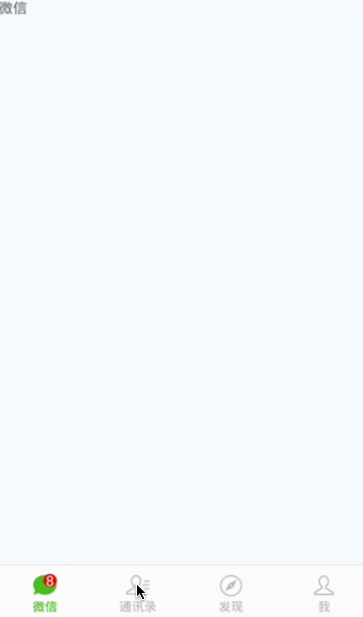

### 1、此 Demo 使用 RN 完成微信基本框架功能

### 2、Demo 的使用步骤

* 1、首先 git clone https://github.com/githubchen001/rn-lesson.git
* 2、cd lesson02/01-wxchatclient/wxchat 目录
* 3、安装依赖 `yarn install`
* 4、react-native run-android/run-ios 查看效果

